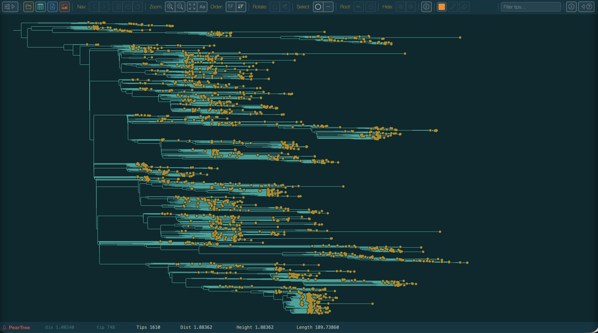

# PearTree Tutorial

This tutorial walks through the main features of PearTree using the built-in Ebola virus (EBOV) example dataset. No files need to be downloaded — everything runs locally in your browser or the desktop app.

---

## 1. Opening the Example Dataset

When you first launch PearTree you will see the startup screen.

>  
> 
> Startup screen showing the "No tree loaded" and the **Open…** and **Example…** buttons.

Click **Example…** to load the built-in EBOV dataset immediately. 

Alternatively, click the open button  (or press **⌘O**) to open the *Open Tree File* dialog, switch to the **Example** tab, and click **Load Example Data**.

> 
>
> *Open Tree File* dialog with the Example tab selected.

After a moment the tree will appear on the canvas.

---

## 2. The Interface at a Glance

The interface has four main areas:

- **Toolbar** (top) — buttons for files, navigation, zoom, ordering, selection, rerooting, and panels
- **Canvas** (centre) — the tree drawing; fills the remaining space
- **Visual Options palette** (left, hidden by default) — all display controls
- **Status bar** (bottom) — live readout of values under the cursor

> 
> 
> EBOV tree loaded and filling the canvas. Tip labels will not currently be visible because of the size of the tree.

---

## 3. Navigating the Tree

There are many ways of quickly navigating the tree which will be useful if the tree is very large.

### Scrolling and Zooming

Firstly you can zoom in and then scroll up and down. You can do this with the mouse/trackpad either using the mouse scroll wheel or a two-fingered drag on the trackpad. Holding the Shift key whilst using the scroll gesture will perform a zoom instead.

| Action | Effect |
|---|---|
| **Scroll** | Pan the tree vertically |
| **⇧ + Scroll** | Zoom in/out, anchored at the mouse position |
| **Pinch** (trackpad) | Zoom in/out |

You can also use the toolbar zoom buttons or keyboard shortcuts:

| Button | Shortcut | Action |
|---|---|---|
|| **⌘=** | Zoom in (×1.5) |
|---| **⌘−** | Zoom out (×1.5) |
|---| **⌘0** | Fit the whole tree to the window |
|---| **⌘⇧0** | Fit Labels — zoom so no tip labels overlap |

Zoom in until individual tip names are readable or press the Fit Labels button or ⌘⇧0 to do this automatically. Press the Fit all button or **⌘0** to return to the full view.

> **📸 SCREENSHOT PLACEHOLDER** — Tree zoomed in to show a small cluster of tips with readable labels.

### Scrolling with Arrow Keys

- **↑ / ↓** — scroll one row at a time
- **⌘↑ / ⌘↓** — scroll one page at a time

---

## 4. Selecting Nodes and Tips

PearTree has two selection modes; **Nodes** mode is active by default.

### Nodes Mode

- **Click a tip** — selects that tip; the status bar shows its name and divergence.
- **Click an internal node** — selects all descendant tips; a teal ring marks the MRCA node.
- **⌘-click** — add to or remove from the current selection.
- **⌘A** — select all visible tips.
- **Click empty space** — clears the selection.

Try clicking an internal node near the root of the EBOV tree.

> **📸 SCREENSHOT PLACEHOLDER** — Several tips selected (highlighted) and MRCA ring visible on an internal node.

### Branches Mode (⌘B)

Press **⌘B** (or click the branch-mode button) to switch to **Branches** mode. Click anywhere along a horizontal branch to place a precise positional marker.

> **📸 SCREENSHOT PLACEHOLDER** — Branch marker (small vertical tick) placed partway along a branch.

Press **⌘B** again to return to **Nodes** mode.

---

## 5. Subtree Navigation

Double-click any internal node to zoom into its subtree. The canvas re-renders showing only the descendants of that node.

> **📸 SCREENSHOT PLACEHOLDER** — A sub-clade of the EBOV tree filling the full canvas after double-clicking.

Use the **History** buttons in the toolbar (or **⌘[** / **⌘]**) to navigate back and forward through your drill-down history.

> **📸 SCREENSHOT PLACEHOLDER** — Toolbar with the Back (**‹**) button highlighted after navigating into a subtree.

---

## 6. The Hyperbolic Lens

The hyperbolic lens lets you expand a region of the tree without zooming — the area near the cursor is stretched to label-readable spacing while the rest compresses to remain visible.

### Activating the Lens

Hold **~** (the backtick/tilde key) and move the cursor over the canvas. The tree distorts around the cursor's vertical position.

> **📸 SCREENSHOT PLACEHOLDER** — Lens active: tips near the cursor are spread apart and readable; tips further away are compressed.

The lens **persists** after you release ~ — the focus stays fixed so you can interact with the expanded region normally. Move with ~ held to reposition it.

Press **Escape** to dismiss the lens with a smooth fade-out animation.

### Adjusting the Lens Width

The **Lens:** button pair in the toolbar (or **⌘⇧+** / **⌘⇧−**) controls the size of the uniformly-expanded centre zone:

- Each press of **⊕** adds one extra row of tip-spacing to the flat centre zone.
- Each press of **⊖** removes one row.
- At zero (default) the lens is a pure hyperbolic falloff from the focus point.

> **📸 SCREENSHOT PLACEHOLDER** — Wide lens (flat zone = 5 rows) showing a broad band of readable tips with gradual compression above and below.

The peak magnification is always capped at the *Fit Labels* spacing level, so labels in the expanded zone never overlap.

---

## 7. Rerooting the Tree

Re-rooting of trees is not possible for trees that are explicitly rooted (generally determined by whether they have annotations for the root node). This will be the case for time calibrated trees from BEAST, for example.

### Midpoint Root (⌘M)

Press **⌘M** (or click **Midpoint** in the toolbar) to automatically root the tree at the midpoint of its longest path. This is a common starting point for exploratory analysis.

> **📸 SCREENSHOT PLACEHOLDER** — EBOV tree after midpoint rerooting; root is repositioned.

### Rerooting at a Selection

1. Select a tip or a group of tips (their MRCA defines the branch).
2. Click the **Reroot** button — the root is placed at the midpoint of the branch above the MRCA.

### Rerooting at an Exact Branch Position

1. Press **⌘B** to enter **Branches** mode.
2. Click precisely where you want the new root on any branch.
3. Click **Reroot**.

> **📸 SCREENSHOT PLACEHOLDER** — Branch mode with marker placed near the base of a clade; tree after rerooting at that position.

---

## 8. Ordering Branches

The **Order** buttons sort the clades by size:

| Button | Shortcut | Effect |
|---|---|---|
| **↑ Ascending** | ⌘D | Larger clades toward the bottom |
| **↓ Descending** | ⌘U | Larger clades toward the top |

The reordering animates smoothly. Click the active button again to cancel the ordering.

> **📸 SCREENSHOT PLACEHOLDER** — EBOV tree with ascending order applied; branch transitions visible mid-animation.

---

## 9. Rotating Nodes

Select an internal node, then use the **Rotate** buttons:

| Button | Effect |
|---|---|
| **↻ Rotate node** | Reverses the direct children of the selected node |
| **⇔ Rotate all** | Recursively reverses children at every level in the selected subtree |

> **📸 SCREENSHOT PLACEHOLDER** — Before and after rotating a node: two clades swap positions.

---

## 10. Hiding and Showing Subtrees

Hiding removes a node and all of its descendants from the tree layout entirely — they simply disappear from the canvas and the remaining tree reflows to fill the space. This is useful for focusing on a subset of the tree without changing the underlying data.

### Hiding a Subtree

1. Select an internal node (its descendant tips will be highlighted).
2. Click the **Hide** button (eye-slash icon) in the toolbar.

The selected node and all its descendants are removed from the view. The tree animates to close the gap, and the branch leading to the hidden node is no longer drawn. The tip count shown elsewhere (e.g. in Node Info) reflects only the still-visible tips.

> **📸 SCREENSHOT PLACEHOLDER** — EBOV tree before and after hiding a clade; the remaining branches have reflowed to fill the canvas.

### Showing Hidden Nodes

To restore hidden nodes:

- **With a node selected** — select the parent node (the branch stub where the hidden subtree was attached) and click **Show** (eye icon). The hidden descendants of that node are restored.
- **With nothing selected** — click **Show** with no selection to reveal *all* hidden nodes in the current view at once.

> **📸 SCREENSHOT PLACEHOLDER** — The same clade restored after clicking Show; tree animates back to the full layout.

> **Note:** Hiding changes the visible tip count, so any active branch ordering (ascending/descending) is automatically cleared when you hide or show nodes.

---

## 11. Node Info (⌘I)

Select any node or tip, then press **⌘I** or click the **ⓘ** button. A dialog lists every annotation on that node — name, divergence, branch length, any BEAST posterior values, or any custom annotations you have imported.

> **📸 SCREENSHOT PLACEHOLDER** — Node Info dialog showing the selected tip's name, divergence, and annotation fields.

---

## 12. Importing Annotations

The EBOV example has annotations embedded in the tree file. To add extra per-tip metadata from your own CSV or TSV:

1. Click the **+ file** button (or press **⌘⇧A**).
2. **Phase 1** — Drag a CSV/TSV onto the drop zone or click *Choose File*.

> **📸 SCREENSHOT PLACEHOLDER** — Import Annotations dialog, Phase 1 (file-pick drop zone).

3. **Phase 2** — Select which column contains the taxon name, tick the columns to import.

> **📸 SCREENSHOT PLACEHOLDER** — Import configuration screen showing column checkboxes and preview rows.

4. Click **Import**. A summary reports how many tips matched.

After import the new annotation keys appear in all *Colour by* dropdowns and the *Legend* selector.

---

## 13. Colouring the Tree by Annotation

Open the **Visual Options palette** (press **Tab** or click the sliders button).

### Colouring Tip Shapes by Annotation

Under **Tip Shapes**, change **Colour by** from *user colour* to an annotation key (e.g. `location` if present in the EBOV tree).

> **📸 SCREENSHOT PLACEHOLDER** — Tip shapes coloured by the `location` annotation; each unique value has a distinct colour.

### Colouring Tip Labels by Annotation

Under **Tip Labels**, change **Colour by** to the same annotation. Labels now match the colours of their shapes.

> **📸 SCREENSHOT PLACEHOLDER** — Tip labels coloured to match tip shapes.

### Colouring Internal Nodes

Under **Node Shapes**, change **Colour by** to an annotation. Internal node circles inherit the colour of the annotation value inferred or stored at that node.

---

## 14. Adding a Legend

In the **Visual Options palette**, scroll to the **Legend** section:

1. Set **Show** to *Left* or *Right*.
2. Set **Annotation** to the key whose colour scale you want to display.

A colour key strip appears at the chosen edge of the canvas.

> **📸 SCREENSHOT PLACEHOLDER** — EBOV tree with a colour legend strip on the right, labelling the `location` annotation colour scale.

---

## 15. Applying a User Colour

1. Select one or more tips.
2. Click the colour swatch in the toolbar to pick a colour.
3. Click the **Apply** button (paint bucket icon) — those tips are marked with that colour.

> **📸 SCREENSHOT PLACEHOLDER** — A handful of tips highlighted in bright orange with the user colour.

User colours are stored as a `user_colour` annotation and can be used in the *Colour by* dropdowns like any other annotation. They round-trip through NEXUS export and re-import.

To remove all user colours, click the **Clear** (eraser) button next to the swatch.

---

## 16. The Time Axis

If the tree file contains node-height annotations (e.g. a BEAST MCC tree with `height` values) and tip dates, an **Axis** section appears in the Visual Options palette.

1. Set **Show** to *On*.
2. Set **Date annotation** to the annotation key holding calendar dates (e.g. `date`).
3. Adjust **Major ticks**, **Minor ticks**, and label formats as needed.

> **📸 SCREENSHOT PLACEHOLDER** — EBOV tree with a time axis along the bottom calibrated to calendar year; major tick labels in `yyyy` format.

---

## 17. Themes and Visual Customisation

The **Theme** section at the top of the Visual Options palette provides quick preset starting points:

| Theme | Description |
|---|---|
| **Artic** | Dark teal background, warm cream labels |
| **Gytis** | White background, black branches |

Changing any individual control (background, branch colour, font size, etc.) switches the selector to *Custom*. Click **Store** to save a named personal theme.

> **📸 SCREENSHOT PLACEHOLDER** — Visual Options palette open on the Theme section with the *Gytis* theme applied; tree rendered on a white background.

### Key Palette Controls

| Section | Control | What it does |
|---|---|---|
| **Canvas** | Background | Canvas background colour |
| **Canvas** | Branches | Branch line colour |
| **Canvas** | Branch width | Stroke thickness (0.5–8 px) |
| **Tip Labels** | Size | Font size (6–20 pt) |
| **Tip Shapes** | Size | Tip circle radius (0 = hidden) |
| **Tip Shapes** | Bg size | Halo radius behind each tip |
| **Node Shapes** | Size | Internal node circle radius |

Click **Reset to defaults** at the bottom of the palette to restore the *Artic* theme.

---

## 18. Exporting the Tree

Click the **↓ file** button (or press **⌘S**) to save the tree.

- **Format** — *NEXUS* (supports annotations and embedded settings) or *Newick* (plain, portable)
- **Scope** — *Entire tree* or *Current subtree view*
- **Annotations** — checkboxes to include or exclude each annotation key
- **Embed settings** (NEXUS only) — ticking this embeds all current visual settings in the file so the appearance is restored automatically when the file is reopened

> **📸 SCREENSHOT PLACEHOLDER** — Export Tree dialog showing NEXUS format selected, two annotation keys checked, and *Embed settings* ticked.

---

## 19. Exporting a Graphic

Click the **image** button (or press **⌘E**) to download an image.

| Setting | Options |
|---|---|
| **Format** | **SVG** (vector, infinitely scalable) or **PNG** (raster at 2× resolution) |
| **View** | **Current view** (the visible portion) or **Full tree** (the complete height) |

SVG exports include branches, labels, shapes, legend strips, and the time axis as true vectors — ideal for publication figures.

> **📸 SCREENSHOT PLACEHOLDER** — Export Graphic dialog; SVG and Full tree selected.

---

## 20. Settings Persistence

PearTree automatically saves all visual settings to browser **localStorage** and restores them on your next visit. This includes theme, palette values, colour-by choices, legend, axis configuration, branch order, and selection mode.

When you export a NEXUS file with **Embed settings** ticked, those settings travel with the file. Opening that file in PearTree restores the full appearance automatically.

---

## Quick-Reference: Keyboard Shortcuts

| Shortcut | Action |
|---|---|
| **⌘O** | Open file picker |
| **⌘⇧O** | Open Tree dialog |
| **⌘⇧A** | Import annotations |
| **⌘S** | Export tree |
| **⌘E** | Export graphic |
| **Tab** | Toggle Visual Options palette |
| **⌘=** / **⌘+** | Zoom in |
| **⌘−** | Zoom out |
| **⌘0** | Fit all |
| **⌘⇧0** | Fit labels |
| **⌘A** | Select all tips |
| **⌘B** | Toggle Nodes / Branches mode |
| **⌘D** | Order ascending |
| **⌘U** | Order descending |
| **⌘M** | Midpoint root |
| **⌘I** | Node info |
| **⌘[** | Navigate back |
| **⌘]** | Navigate forward |
| **~** (hold) | Activate hyperbolic lens at cursor |
| **⌘⇧+** | Expand lens area |
| **⌘⇧−** | Contract lens area |
| **Escape** | Dismiss lens / close dialog / clear selection |

> On Windows and Linux replace **⌘** with **Ctrl**.
